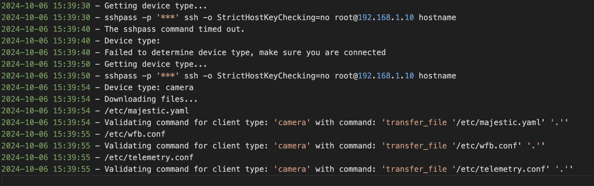

# OpenIPC Config Shell
So the OpenIPC Configurator is a Windows only app, I can run it on my Windows instance running in Parallel but for some reason I cannot get the Mario drivers to work. So instead of not having any options in Mac aside from SSH I decided to convert the extern.bat to a bach script but also add some checks.

I am also looking into a Project using Avalonia, we can then have an App that runs on Mac, Windows and Linux.

## PreReqs

brew install hudochenkov/sshpass/sshpass

## Screenshots

View of log file

I do this for fun only, I love to fly and tinker with all kinds of technical projects. 